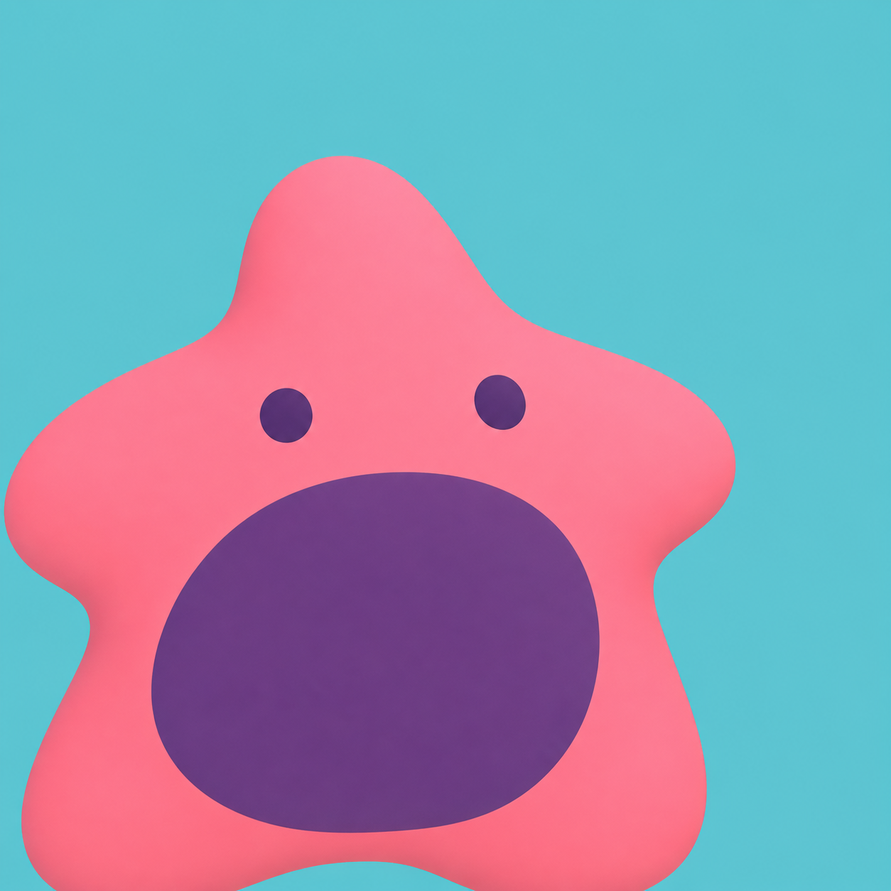
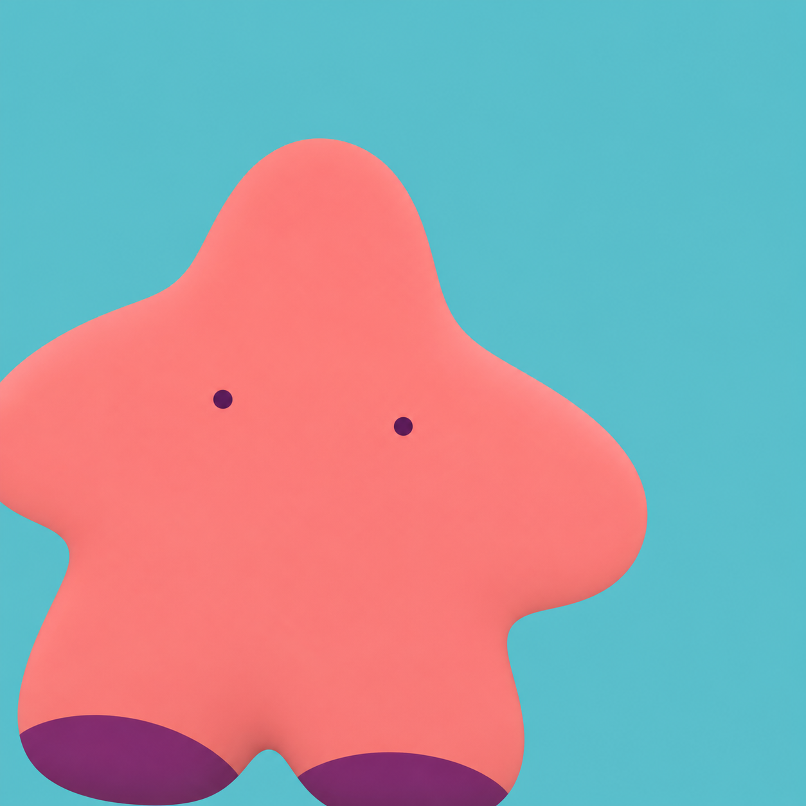
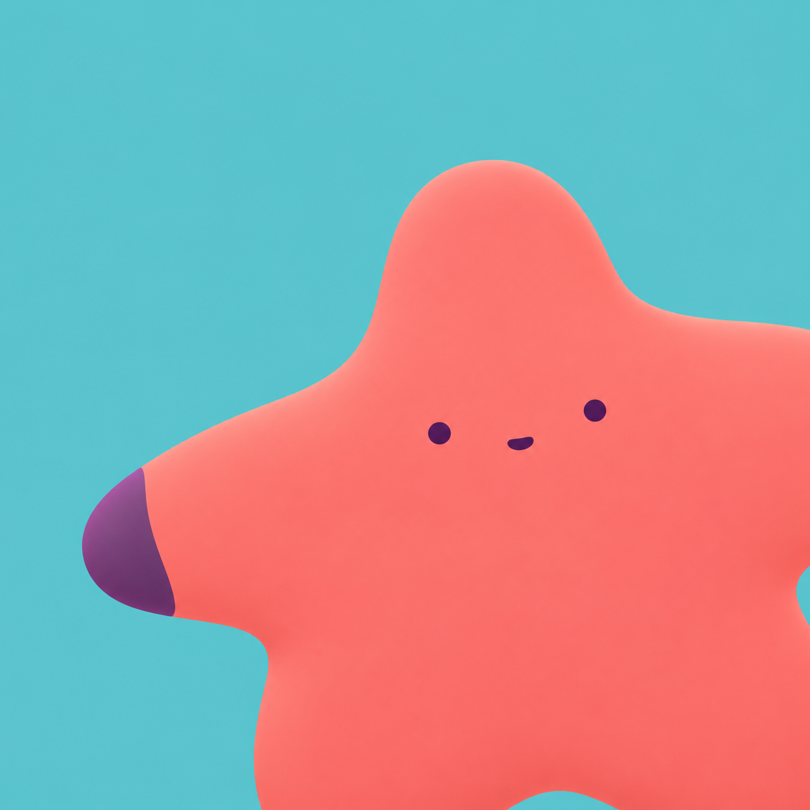
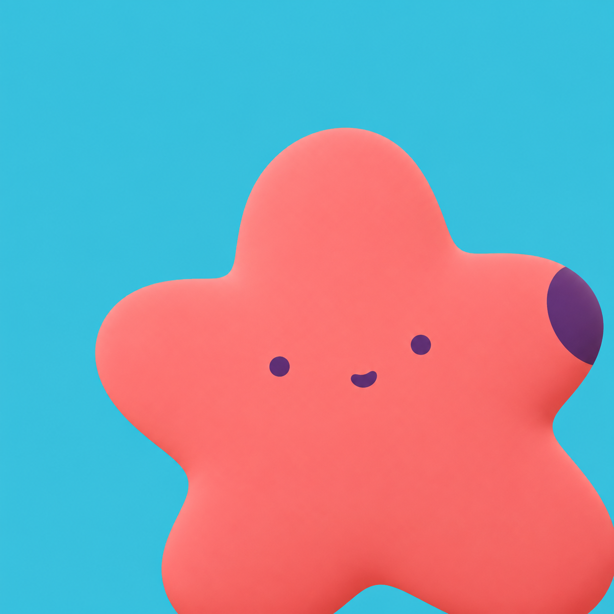

# IP as Logo Gallery

A public collection of original, highly simplified mascot logo explorations created with the [ip-as-logo skill](https://github.com/s1dashu/ip-as-logo-skill).

使用 ip-as-logo 工作流创作的原创极简角色 Logo 图库。

## Collection

- 19 full-resolution square PNG files
- Native image size: 1254 × 1254 pixels
- 4 generation reports with prompt and color mappings
- One-pass outputs preserved without automatic ranking, rejection, or repair

## Purple Ghost

Six original purple ghost mascot studies.

[Generation report](reports/purple-ghost.md)

| A1 | A2 | B1 |
| --- | --- | --- |
|  |  |  |

| B2 | C1 | C2 |
| --- | --- | --- |
|  |  |  |

## Pink Sea-Star — V1

The first six original pink sea-star mascot studies.

[Generation report](reports/pink-sea-star-v1.md)

| A1 | A2 | B1 |
| --- | --- | --- |
|  |  |  |

| B2 | C1 | C2 |
| --- | --- | --- |
|  |  |  |

## Pink Sea-Star — V2

Six revised studies with the face placed directly on the coral-pink body and the secondary color moved away from the face.

[Generation report](reports/pink-sea-star-v2.md)

| A1 | A2 | B1 |
| --- | --- | --- |
|  |  |  |

| B2 | C1 | C2 |
| --- | --- | --- |
|  |  |  |

## Mount Fuji Buddy

One original personified Mount Fuji-inspired mountain mascot.

[Generation report](reports/mount-fuji.md)

## Structure

    assets/
      mount-fuji/
      pink-sea-star/
        v1/
        v2/
      purple-ghost/
    reports/

## Notes

These are independent original mascot explorations. This repository is not affiliated with, endorsed by, or sponsored by any third-party franchise, brand, or rights holder.

No reuse license has been selected for this collection.
